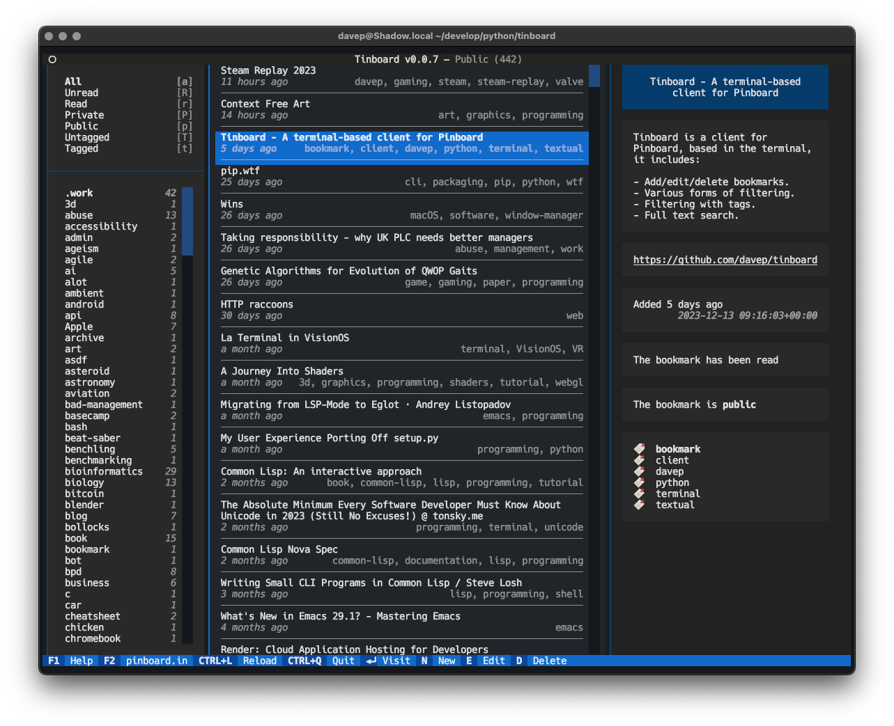

# TinBoard

A very early work in progress. This will be turning into a full
terminal-based Pinboard client. At the moment this is a read-only client;
something to let me riff on the interface and decide what I like. Once that
has settled down I'll be adding full write capability too.

All application data lives in `~/.local/share/tinboard`; if you want to wipe
it out just nuke that directory.

As for bugs and feature requests and stuff... not yet thanks; that time will
come. :-)

Things to do:

- [ ] Full text search.
- [ ] Allow tags to be combined with core filters.
- [ ] Allow both the above to be combined.
- [ ] Add the ability to add a bookmark.
- [ ] Add the ability to edit a bookmark.
- [ ] Add the ability to delete a bookmark.
- [ ] Add the ability to quickly toggle the unread/read status of a
      bookmark.
- [ ] Add the ability to quickly toggle the public/private status of a
      bookmark.
- [ ] Add the ability to "logout" (IOW forget the API token).
- [ ] Add a bookmark export facility.
- [ ] Add tag counts to the tag list.

[//]: # (README.md ends here)
